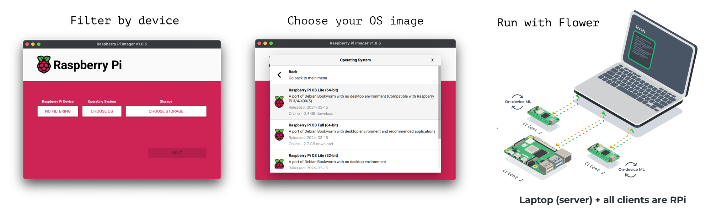

# Flower Tutorial

> This tutorial includes the code presented in Flower Labs guest lecture that you can watch [on YouTube](https://youtu.be/Qw8uisfsBC8?si=pcLH53h0bT8V982h). The section talking about the code begins approximately after 1h:18min.


This tutorial covers the basics of 🌼[Flower](https://flower.ai/). You'll learn how to design a typical client+server FL pipeline for image classification using FedAvg. This tutorial uses PyTorch and [Flower Datasets](https://flower.ai/docs/datasets/). Just like in the lectures, this tutorial is split into three parts:

- **Part-A: Running server with 2x clients in the terminal**: this is the preferred setup when you are starting or when you are in the early phases of prototyping your application.

- **Part-B: Running a simulation with 1k clients**: We'll take the exact same client + strategy used in part-A and show how simple it is to scale such system to thousands of clients using Flower's Simulation Engine.

- **Part-C: Running Raspberry Pi devices as Flower clients**: Flower let's you run your FL workloads on real devices. We'll take the same clients designed in part-A and run them on a Raspberry Pi while the server remains on your development machine (e.g your laptop).

> If you enjoy this material don't forget to give a ⭐️ to the [Flower Github repository](https://github.com/adap/flower)!

If you have questions about Flower, ask them on [discuss.flower.ai](https://discuss.flower.ai) or join the [Flower Slack](https://flower.ai/join-slack/) for other general topics.

## Environmnet setup

To start with this tutorial you'll need to create a Python environment and install some dependencies. The instructions here show you to do this with [Conda](https://conda.io/projects/conda/en/latest/user-guide/getting-started.html) but feel free to use any other tool (e.g. `Poetry`, `pyenv` -- we'll use the latter for Part-C).

```bash
# Create a conda environment named "aalto-fl" that uses python 3.10
conda create -n aalto-fl python=3.10 -y

# Activate the environment
# Depending on how you installed conda, you might need
# to replace "conda" with "source"
conda activate aalto-fl

# Install Flower and other dependencies
pip install -r requirements.txt
```

## Part-A: Server and 2x Clients

Let's begin with a simple but fairly complete Flower setup comprising just two files.

- `server.py`: defines a strategy (in charged of sampling clients, communicating the global model, and performing aggregation) and launches the Flower Server to which clients will connect. You'll notice we wrap the definition of the `FedAvg` strategy inside a function, we simply do this in this example so we can reutilize it easier for Part-B. The `weighted_average` is passed to the strategy to perform the weighted average of the _metrics_ (i.e. accuracy, loss) results returned by clients during an _evaluate_ round.

- `client.py`: defines a class `FlowerClient` that implements all the application-level functionality of a Flower client. In this tutorial this means training an image classification model in FL. This necessitates of several components, namely: data loaders to be passed to the client; training and evaluation functions; and model definition. The code is documented.

### Running the code

You'll need to open three terminals to run Part-A (maybe this is a good time to give [Tmux](https://github.com/tmux/tmux/wiki) a try!). One for the server and one for each of the two clients.

First, start the server:
```bash
python server.py
INFO flwr 2024-03-19 07:44:30,668 | app.py:163 | Starting Flower server, config: ServerConfig(num_rounds=3, round_timeout=None)
INFO flwr 2024-03-19 07:44:30,678 | app.py:176 | Flower ECE: gRPC server running (3 rounds), SSL is disabled
INFO flwr 2024-03-19 07:44:30,679 | server.py:89 | Initializing global parameters
INFO flwr 2024-03-19 07:44:30,679 | server.py:276 | Requesting initial parameters from one random client
# It will wait for at least 2 clients to connect
```

Now launch two clients on two different terminals. If you decide to do this on a different machine to where the server is running, you'll need to pass the `--server-address` argument.

```bash
python client.py --partition-id 0
# then, on a different terminal run
python client.py --partition-id 1
```

As soon as the second client connects with the server, the first FL round will commence. At the end you should see a log printed by the server like this one (it might in future versions of Flower, 1.8+):

```bash
INFO flwr 2024-03-19 07:42:22,936 | app.py:163 | Starting Flower server, config: ServerConfig(num_rounds=3, round_timeout=None)
INFO flwr 2024-03-19 07:42:22,946 | app.py:176 | Flower ECE: gRPC server running (3 rounds), SSL is disabled
INFO flwr 2024-03-19 07:42:22,946 | server.py:89 | Initializing global parameters
INFO flwr 2024-03-19 07:42:22,946 | server.py:276 | Requesting initial parameters from one random client
INFO flwr 2024-03-19 07:42:31,709 | server.py:280 | Received initial parameters from one random client
INFO flwr 2024-03-19 07:42:31,709 | server.py:91 | Evaluating initial parameters
INFO flwr 2024-03-19 07:42:31,709 | server.py:104 | FL starting
DEBUG flwr 2024-03-19 07:42:34,109 | server.py:222 | fit_round 1: strategy sampled 2 clients (out of 2)
DEBUG flwr 2024-03-19 07:42:37,331 | server.py:236 | fit_round 1 received 2 results and 0 failures
WARNING flwr 2024-03-19 07:42:37,332 | fedavg.py:250 | No fit_metrics_aggregation_fn provided
DEBUG flwr 2024-03-19 07:42:37,332 | server.py:173 | evaluate_round 1: strategy sampled 2 clients (out of 2)
DEBUG flwr 2024-03-19 07:42:37,565 | server.py:187 | evaluate_round 1 received 2 results and 0 failures
DEBUG flwr 2024-03-19 07:42:37,565 | server.py:222 | fit_round 2: strategy sampled 2 clients (out of 2)
DEBUG flwr 2024-03-19 07:42:40,705 | server.py:236 | fit_round 2 received 2 results and 0 failures
DEBUG flwr 2024-03-19 07:42:40,706 | server.py:173 | evaluate_round 2: strategy sampled 2 clients (out of 2)
DEBUG flwr 2024-03-19 07:42:40,941 | server.py:187 | evaluate_round 2 received 2 results and 0 failures
DEBUG flwr 2024-03-19 07:42:40,941 | server.py:222 | fit_round 3: strategy sampled 2 clients (out of 2)
DEBUG flwr 2024-03-19 07:42:44,148 | server.py:236 | fit_round 3 received 2 results and 0 failures
DEBUG flwr 2024-03-19 07:42:44,149 | server.py:173 | evaluate_round 3: strategy sampled 2 clients (out of 2)
DEBUG flwr 2024-03-19 07:42:44,380 | server.py:187 | evaluate_round 3 received 2 results and 0 failures
INFO flwr 2024-03-19 07:42:44,380 | server.py:153 | FL finished in 12.671216374990763
INFO flwr 2024-03-19 07:42:44,380 | app.py:226 | app_fit: losses_distributed [(1, 61.26287841796875), (2, 24.538291931152344), (3, 10.658092975616455)]
INFO flwr 2024-03-19 07:42:44,380 | app.py:227 | app_fit: metrics_distributed_fit {}
INFO flwr 2024-03-19 07:42:44,381 | app.py:228 | app_fit: metrics_distributed {'accuracy': [(1, 0.825), (2, 0.93875), (3, 0.966875)]}
INFO flwr 2024-03-19 07:42:44,381 | app.py:229 | app_fit: losses_centralized []
INFO flwr 2024-03-19 07:42:44,381 | app.py:230 | app_fit: metrics_centralized {}
```

In our example, the line `metrics_distributed {'accuracy': [(1, 0.825), (2, 0.93875), (3, 0.966875)]}` is the most relevant, as it tells us what was the performance of the global model when evaluated on each client's validation set and averaging that over the number of clients sampled. We can see that after just three rounds the model reached close to 97% accuracy.

## Part-B: FLower Simulation with 1000 Clients

Let's do something more exciting than just running two clients. We'll be using Flower's Simulation Engine to run a federation of 1K clients (but you can use more if you want). To launch our simulation we don't need of any fundamental change to the code and only need a minimal "launch" script to start the simulation. If you inspect `sim.py` you'll see we reuse most of the components designed in Part-A but instead of manually starting clients and server, we delegate that functionality to the Simulation Engine. One of the key concepts to keep in mind with the Simulation Engine is that: as long as your system can run a single client, you can run a simulation as large as you want since the spawning of clients is performed in a resource-aware fashion.


### Running the code

> This example does not make use of the most optimal hyperparameter values (e.g. learning rates, number of epochs, etc). Your global model will converge faster if you adjust the hyperparameters.

To start the simulation, simply run `sim.py`:
```bash
# With default settings, 100 clients will be sampled on each round
# Feel free to adjust this by changing the arguments passed to
# the get_strategy() function in sim.py
python sim.py
```

As discussed during the lecture, Flower strategies allow for a high degree of customization. In `sim_global_eval.py` we show how to enable centralized evaluation of the model using the whole MNIST dataset. It also shows how to use the History object returned by the simulation and make a simple line plot of _centralized accuracy_ over rounds. Note we are only modifying the strategy, you could therefore have the same functionality in Part-A should you add the additional lines of code needed for _centralized evaluation_.

```bash
# With default arguments runs 100 clients per round
# and does 30 FL rounds.
python sim_global_eval.py
```


You can read more about Flower's Simulation Engine in [the documentation](https://flower.ai/docs/framework/how-to-run-simulations.html). Simulations are also the preferred way of using Flower in Notebooks such as those in Google Colab. You can find a few notebooks in [Flower's Github](https://github.com/adap/flower).

## Part-C: Flower clients on Raspberry Pi devices

One of the many strengths of Flower is its versatility. The same code we used in Part-A can be used for large simulations (as done in Part-B) and now we'll see how to use it on IoT devices like Raspberry Pi. As far as the code is concerned, no changes are needed. This part of the tutorial first walks you through the steps I follow to setup a Raspberry Pi. As of today (March 2024) a Raspberry Pi 5 costs ~70 Euros and a Raspberry Pi Zero 2 ~20 Euros.



> You can run this part of the tutorial even with a single Raspberry Pi but you'll need a at least another client connected to the server. You could simply run one as shown in Part-A.

1. Flash a uSD card with Raspberry Pi OS using the [Raspberry Pi Imager](https://www.raspberrypi.com/software/). I used `Raspberry Pi OS (64 bit) Lite` which doesn't come with a graphical interface. But feel free to use a different one. Using `Ubuntu` should also work.

2. Connect via `ssh` to your Raspberry Pi.There are many guides online showing how to do this ([here](https://www.raspberrypi.com/documentation/computers/remote-access.html), [here](https://raspberrypi-guide.github.io/networking/connecting-via-ssh), and [here](https://www.onlogic.com/company/io-hub/how-to-ssh-into-raspberry-pi/)). If you pre-configure the access to your Wifi, the Raspberry Pi should be able to connect automatically, then you should be able to `ssh` directly to it via `ssh <name>.local`, where `name` is the device name you specified in the configuration step before flashing your uSD card.

3. Updating and Installing development packages. All the steps below are not strictly needed, but this will provide you with prettymuch everything you need for Python development on Raspberry Pi:
    ```bash
    # Update
    sudo apt-get update

    # Install packages
    sudo apt-get install build-essential git tmux zlib1g-dev libssl-dev \
        libsqlite3-dev libreadline-dev libbz2-dev libffi-dev liblzma-dev zsh -y

    # Let's add mouse support to tmux
    echo "set-option -g mouse on" >> ~/.tmux.conf

    # pyenv install
    git clone https://github.com/pyenv/pyenv.git ~/.pyenv

    # update .bashrc
    echo 'export PYENV_ROOT="$HOME/.pyenv"' >> ~/.bashrc
    echo 'command -v pyenv >/dev/null || export PATH="$PYENV_ROOT/bin:$PATH"' >> ~/.bashrc
    echo 'eval "$(pyenv init -)"' >> ~/.bashrc

    # reload
    source ~/.bashrc
    ```

    (Optional, not needed for Raspberry Pi 4 or 5): If you are using a device with very little amount of RAM (e.g. a Raspberry Pi Zero 2, which comes with jsut 512 MB of RAM), you might want to increase the size of your `swap` partition. You can do so like this:

    Finally, install a recent version of Python and Pyenv's virtual environment package:
    ```bash
    # Install a recent version of Python
    # Please note this might take a while on slow devices (e.g. RPi Zero 2)
    pyenv install 3.10.12

    # Install Pyenv's virtual environment module
    git clone https://github.com/pyenv/pyenv-virtualenv.git $(pyenv root)/plugins/pyenv-virtualenv
    exec "$SHELL"
    ```

4. Create a new Python environemt and install the dependencies.
    ```bash
    # Create a virtualenvironment with the python version we just installed it
    # name the environment `aalto-fl`
    pyenv virtualenv 3.10.12 aalto-fl

    # Activate your environment
    pyenv activate aalto-fl

    # Install dependencies
    pip install flwr "flwr-datasets[vision]" torch==1.13.1 torchvision==0.14.1 matplotlib==3.8.3 tqdm==4.65.0
    ```

5. Run a client on the Raspberry Pi: First you'll need to copy the `client.py` in this repository into your Raspberry Pi. You can do so with either `scp` or via "copy/paste" if you interactively create a new file on your device (e.g. with `nano`). Ensure you have a server running on a different device (e.g. on your laptop), then start the client:
    ```bash
    python client.py --partition-id 0 --server-address <IP-SERVER-DEVICE:8080>
    # for example: --server-address="192.168.1.78:8080" if that's the IP of the
    # machine where you run the server from
    ```


## Additional Content

The Flower GitHub repository contains over [30 examples and tutorials](https://github.com/adap/flower/tree/main/examples) using different ML frameworks and data modalities. Below I list a few examples:

* [Fine-tuning of a Vision Transformer](https://github.com/adap/flower/tree/main/examples/vit-finetune)
* [Federated Fine-tuning of an LLM](https://github.com/adap/flower/tree/main/examples/llm-flowertune)
* [Federated Fine-tuning of Open AI's Whisper](https://github.com/adap/flower/tree/main/examples/whisper-federated-finetuning)
* [Flower with Docker and Grafana](https://github.com/adap/flower/tree/main/examples/flower-via-docker-compose)
* Quick-start examples:
    * [PyTorch](https://github.com/adap/flower/tree/main/examples/quickstart-pytorch)
    * [TensorFlow](https://github.com/adap/flower/tree/main/examples/quickstart-tensorflow)
    * [XGBoost](https://github.com/adap/flower/tree/main/examples/xgboost-quickstart)

Even more learning materials can be found on [flower.ai/docs/framework/](https://flower.ai/docs/framework/) and video tutorials in our [Youtube Channel](https://www.youtube.com/@flowerlabs).

